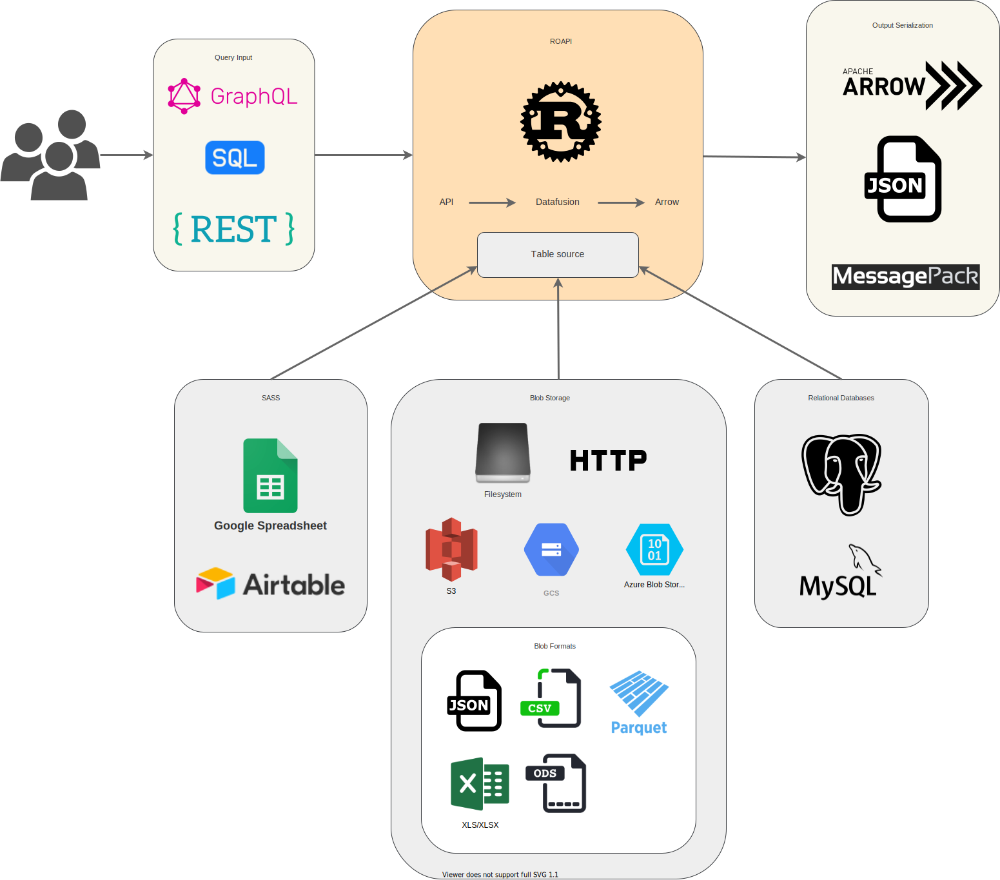

# ROAPI


ROAPI automatically spins up read-only APIs for static datasets without
requiring you to write a single line of code. It builds on top of [Apache
Arrow](https://github.com/apache/arrow) and
[Datafusion](https://github.com/apache/arrow/tree/master/rust/datafusion). The
core of its design can be boiled down to the following:

* Query frontends to translate SQL, GraphQL and REST API queries into
Datafusion plans.
* Datafusion for query plan exection.
* Data layer to load datasets from a variety of sources and formats with
automatic schema inference.
* Response encoding layer to serialize intermediate Arrow record batch into
various formats requested by client.

See below for a high level diagram:




## Installation

```bash
cargo install --git https://github.com/roapi/roapi --bin roapi-http
```

## Usage

### Quick start

Spin up APIs for `test_data/uk_cities_with_headers.csv` and
`test_data/spacex-launches.json`:

```bash
roapi-http \
    --table 'uk_cities:test_data/uk_cities_with_headers.csv'
    --table 'spacex_launches:test_data/spacex-launches.json'
```

Query tables using SQL, GraphQL or REST:

```bash
curl -X POST -d "SELECT city, lat, lng FROM uk_cities LIMIT 2" localhost:8080/api/sql
curl -X POST -d "query { uk_cities(limit: 2) {city, lat, lng} }" localhost:8080/api/graphql
curl "localhost:8080/api/tables/uk_cities?columns=city,lat,lng&limit=2"
```

Get inferred schema for all tables:

```bash
curl 'localhost:8080/api/schema'
```


### Config file

You can also configure multiple table sources using YAML config, which supports more
advanced format specific table options:

```yaml
addr: 0.0.0.0:8084
tables:
  - name: "blogs"
    uri: "test_data/blogs.parquet"

  - name: "ubuntu_ami"
    uri: "test_data/ubuntu-ami.json"
    option:
      format: "json"
      pointer: "/aaData"
      array_encoded: true
    schema:
      columns:
        - name: "zone"
          data_type: "Utf8"
        - name: "name"
          data_type: "Utf8"
        - name: "version"
          data_type: "Utf8"
        - name: "arch"
          data_type: "Utf8"
        - name: "instance_type"
          data_type: "Utf8"
        - name: "release"
          data_type: "Utf8"
        - name: "ami_id"
          data_type: "Utf8"
        - name: "aki_id"
          data_type: "Utf8"

  - name: "spacex_launches"
    uri: "https://api.spacexdata.com/v4/launches"
    option:
      format: "json"

  - name: "github_jobs"
    uri: "https://jobs.github.com/positions.json"
```

To run serve tables using config file:

```bash
roapi-http -c ./roapi.yml
```


### Google spreadsheet as table source

To serve a Google spreadsheet as API, you need to gather the following config values:

* Google spreadsheet URL
* Google spreadsheet sheet title (bottom of the spreadsheet UI)
* Service account secret key

Here are the steps to configure the service account:

1. Activate the Google Sheets API in the Google API Console.
1. Create service account: https://console.developers.google.com/apis/api/sheets.googleapis.com/credentials.
1. Go into service account setting and click `ADD KEY`. Then select JSON format
   and save it somewhere safe.
1. Go back to Google spreadsheet and share it with the newly created service
   account through service account email).

ROAPI config to load the google spreadsheet as data source:

```yaml
tables:
  - name: "table_name"
    uri: "https://docs.google.com/spreadsheets/d/1-lc4oij04aXzFSRMwVBLjU76s-K0-s6UPc2biOvtuuU#gid=0"
    option:
      format: "google_spreadsheet"
      application_secret_path: "path/to/service_account_key.json"
      sheet_title: "sheet_name_within_google_spreadsheet"
```


### Response serialization

By default, roapi encodes responses in JSON format, but you can request
different encoding by specifying the `ACCEPT` header:

```
curl -X POST \
    -H 'ACCEPT: application/vnd.apache.arrow.stream' \
    -d "SELECT launch_library_id FROM spacex_launches WHERE launch_library_id IS NOT NULL" \
    localhost:8080/api/sql
```


### REST API query interface

You can query tables through REST API by sending `GET` requests to
`/api/tables/{table_name}`. Query operators are specified as query params.

REST API currently supports the following query operators:

* columns
* sort
* limit
* filter

To sort column `col1` in ascending order and `col2` in descending order, set
query param to: `sort=col1,-col2`.

To find all rows with `col1` equal to string `'foo'`, set query param to:
`filter[col1]='foo'`. You can also do basic comparisons with filters, for
example predicate `0 <= col2 < 5` can be expressed as
`filter[col2]gte=0&filter[col2]lt=5`.


### GraphQL query interface

To query tables through GraphQL, send the query through `POST` request to
`/api/graphql` endpoint.

GraphQL query interface supports the same set of operators supported by REST
API. Here how you can apply various operators to your query:

```graphql
{
    table_name(
        filter: {
            col1: false
            col2: { gteq: 4, lt: 1000 }
        }
        sort: [
            { field: "col2", order: "desc" }
            { field: "col3" }
        ]
        limit: 100
    ) {
        col1
        col2
        col3
    }
}
```


### SQL query interface

To query tables through a subset of standard SQL, send the query through `POST`
request to `/api/sql` endpoint. This is the only query interface that supports
table joins.


## Features

Query layer:
  - [x] REST API GET
  - [x] GraphQL
  - [x] SQL
  - [ ] join between tables
  - [ ] support filter on nested struct fields
  - [ ] index
  - protocol
    - [ ] gRPC
    - [ ] MySQL
    - [ ] Postgres

Response serialization:
  - [x] JSON `application/json`
  - [x] Arrow `application/vnd.apache.arrow.stream`
  - [ ] msgpack

Data layer:
  - [x] filesystem
  - [x] HTTP/HTTPS
  - [ ] S3
  - [ ] GCS
  - [ ] ABS
  - [x] Google spreadsheet
  - [ ] MySQL
  - [ ] Postgres
  - [ ] Airtable
  - Data format
    - [x] CSV
    - [x] JSON
    - [x] parquet
    - [ ] xls, xlsx, xlsm, ods: https://github.com/tafia/calamine

Misc:
  - [ ] auto gen OpenApi doc for rest layer
  - [ ] query input type conversion based on table schema
  - [ ] stream arrow encoding response
  - [ ] authentication layer


## Development

The core of ROAPI, including query frontends and data layer, lives in the
self-contained [columnq](https://github.com/roapi/roapi/tree/main/columnq)
crate. It takes queries and outputs Arrow record batches. Data sources will
also be loaded and stored in memory as Arrow record batches.

The [roapi-http](https://github.com/roapi/roapi/tree/main/roapi-http) crate
wraps `columnq` with a HTTP based API layer. It serializes Arrow record batches
produced by `columnq` into different formats based on client request.

Building ROAPI with `simd` optimization requires nightly rust toolchain.
